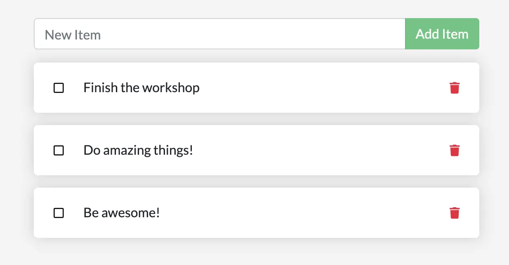
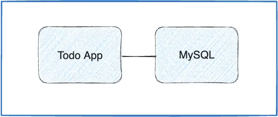

# Table of Contents <!-- omit in toc -->

- [1. Overview of the Docker workshop](#1-overview-of-the-docker-workshop)
- [2. Part 1: Containarize an application](#2-part-1-containarize-an-application)
  - [2.1. Get the app](#21-get-the-app)
  - [2.2. Build the app's image](#22-build-the-apps-image)
  - [2.3. Start an app container](#23-start-an-app-container)
  - [2.4. Summary](#24-summary)
- [3. Part 2: Update the application](#3-part-2-update-the-application)
  - [3.1. Update the source code](#31-update-the-source-code)
  - [3.2. Remove the old container](#32-remove-the-old-container)
    - [3.2.1. Method-1: Remove a container using the CLI](#321-method-1-remove-a-container-using-the-cli)
    - [3.2.2. Method-2: Remove a container using Docker Desktop](#322-method-2-remove-a-container-using-docker-desktop)
  - [3.3. Start the updated app container](#33-start-the-updated-app-container)
  - [3.4. Summary](#34-summary)
- [4. Part 3: Share the application](#4-part-3-share-the-application)
  - [4.1. Create a repository](#41-create-a-repository)
  - [4.2. Push the image](#42-push-the-image)
  - [4.3. Run the image on a new instance](#43-run-the-image-on-a-new-instance)
  - [4.4. Summary](#44-summary)
- [5. Part 4: Persist the DB](#5-part-4-persist-the-db)
  - [5.1. The container's filesystem](#51-the-containers-filesystem)
    - [5.1.1. See this in practice](#511-see-this-in-practice)
  - [5.2. Container volumes](#52-container-volumes)
  - [5.3. Persist the todo data](#53-persist-the-todo-data)
    - [5.3.1. Create a volume and start the container](#531-create-a-volume-and-start-the-container)
      - [5.3.1.1. Method 1: create volume using CLI](#5311-method-1-create-volume-using-cli)
      - [5.3.1.2. Method 2: create volume using Docker Desktop](#5312-method-2-create-volume-using-docker-desktop)
    - [5.3.2. Verify that the data persists](#532-verify-that-the-data-persists)
  - [5.4. Dive into the volume](#54-dive-into-the-volume)
  - [5.5. Summary](#55-summary)
- [6. Part 5: Use bind mounts](#6-part-5-use-bind-mounts)
  - [6.1. Quick volume type comparisons](#61-quick-volume-type-comparisons)
  - [6.2. Trying out bind mounts](#62-trying-out-bind-mounts)
  - [6.3. Development containers](#63-development-containers)
    - [6.3.1. Run your app in a development container](#631-run-your-app-in-a-development-container)
      - [6.3.1.1. Method-1: Using CLI (Recommended)](#6311-method-1-using-cli-recommended)
      - [6.3.1.2. Method-2: Using Docker Desktop](#6312-method-2-using-docker-desktop)
    - [6.3.2. Develop your app with the development container](#632-develop-your-app-with-the-development-container)
- [7. Part 6: Multi container apps](#7-part-6-multi-container-apps)
  - [7.1. Container networking](#71-container-networking)
  - [7.2. Start MySQL](#72-start-mysql)
  - [7.3. Connect to MySQL](#73-connect-to-mysql)
  - [7.4. Run your app with MySQL](#74-run-your-app-with-mysql)
- [8. Use Docker Compose](#8-use-docker-compose)
  - [8.1. Create the Compose file](#81-create-the-compose-file)
  - [8.2. Define the app service](#82-define-the-app-service)
  - [8.3. Define the MySQL service](#83-define-the-mysql-service)
  - [8.4. Run the application stack](#84-run-the-application-stack)
  - [8.5. See the app stack in Docker Desktop Dashboard](#85-see-the-app-stack-in-docker-desktop-dashboard)
  - [8.6. Tear it all down](#86-tear-it-all-down)
- [9. Image-building best practices](#9-image-building-best-practices)
  - [9.1. Image layering](#91-image-layering)
  - [9.2. Layer caching](#92-layer-caching)
  - [Multi-stage builds](#multi-stage-builds)
    - [React example](#react-example)

# 1. Overview of the Docker workshop

This workshop contains step-by-step instructions on how to get started with Docker. We'll be working with a simple 'todo list manager' that runs on `Node.js`. This workshop shows you how to:

- Build and run an image as a container.
- Share images using Docker Hub.
- Deploy Docker applications using multiple containers with a database.
- Run applications using Docker Compose.

# 2. Part 1: Containarize an application

## 2.1. Get the app

1. Clone the starter repo from: https://github.com/docker/getting-started-app.git.
2. remove the existing `.git` folder if you want.
3. You should see the following files and sub-directories:

```
├── getting-started-app/
│ ├── .dockerignore
│ ├── package.json
│ ├── package-lock.json
│ ├── README.md
│ ├── spec/
│ ├── src/
```

## 2.2. Build the app's image

To build the image, you'll need to use a `Dockerfile`. A **Dockerfile** is simply a text-based file with no file extension that contains a script of instructions. Docker uses this script to build a container image.

1. Create Dockerfile

In the `getting-started-app` directory, the same location as the `package.json` file, create a file named `Dockerfile` with the following contents:

```dockerfile
# syntax=docker/dockerfile:1

FROM node:24-alpine
WORKDIR /app
COPY . .
RUN npm install --omit=dev
CMD ["node", "src/index.js"]
EXPOSE 3000
```

This Dockerfile does the following:

- Uses `node:24-alpine` as the base image, a lightweight Linux image with `Node.js` pre-installed
- Sets `/app` as the working directory (in image)
- Copies source code into the image (into `/app`)
- Installs the necessary dependencies
- Specifies the command to start the application
- Documents that the app listens on port 3000

2. Build the image

In the terminal, make sure you're in the `getting-started-app` directory:

```bash
$ cd /path/to/getting-started-app
```

Build the image:

```bash
$ docker build -t getting-started .
```

The `docker build` command uses the `Dockerfile` to build a new image. You might have noticed that Docker downloaded a lot of "layers". This is because you instructed the builder that you wanted to start from the `node:24-alpine` image. But, since you didn't have that on your machine, Docker needed to download the image.

After Docker downloaded the image, the instructions from the Dockerfile copied in your application and used npm to install your application's dependencies.

Finally, the `-t` flag tags your image. Think of this as a human-readable name for the final image. You can refer to that image name when you run a container.

The `.` at the end of the docker build command tells Docker that it should look for the `Dockerfile` in the current directory.

## 2.3. Start an app container

1. Run your container using the `docker run` command and specify the name of the image you just created:

```bash
$ docker run -d -p 127.0.0.1:3000:3000 getting-started
```

- The `-d` flag (short for `--detach`) runs the container in the background. This means that Docker starts your container and returns you to the terminal prompt. Also, it does not display logs in the terminal.

- The `-p` flag (short for `--publish`) creates a port mapping between the host and the container. The `-p` flag takes a string value in the format of `HOST:CONTAINER`, where `HOST` is the address on the host, and `CONTAINER` is the port on the container. The command publishes the container's port `3000` to `127.0.0.1:3000` (`localhost:3000`) on the host. Without the port mapping, you wouldn't be able to access the application from the host.

2. After a few seconds, open your web browser to http://localhost:3000. You should see your app.

3. Add an item or two and see that it works as you expect. You can mark items as complete and remove them. Your frontend is successfully storing items in the backend.

At this point, you have a running `todo list manager` with a few items.

If you take a quick look at your containers on Docker Desktop (or using `docker ps` command), you should see at least one container running that's using the `getting-started` image and on port `3000`.

## 2.4. Summary

In this section, you learned the basics about creating a `Dockerfile` to build an image. Then you started a container and saw the running app.

[⬆️ Return to Table of contents](#table-of-contents)

# 3. Part 2: Update the application

In this part, you'll update the application and image. You'll also learn how to stop and remove a container.

## 3.1. Update the source code

In the following steps, you'll change the "empty text" when you don't have any todo list items to "You have no todo items yet! Add one above!"

1. In the `src/static/js/app.js` file, update line 56 (may differ) to use the new empty text.

```
- <p className="text-center">No items yet! Add one above!</p>
+ <p className="text-center">You have no todo items yet! Add one above!</p>
```

2. Build your updated version of the image, using the `docker build` command.

```bash
$ docker build -t getting-started .
```

3. Start a new container using the updated code.

```bash
$ docker run -dp 127.0.0.1:3000:3000 getting-started
```

You probably saw an error like this:

```
docker: Error response from daemon:......: Bind for 127.0.0.1:3000 failed: port is already allocated.
```

The reason is that the old container is already using the host's port `3000` and only one process on the machine (containers included) can listen to a specific port. To fix this, you need to remove the old container.

## 3.2. Remove the old container

To remove a container, you first need to stop it. Then, you can remove it.

You can remove the old container using the CLI or Docker Desktop's graphical interface.

### 3.2.1. Method-1: Remove a container using the CLI

1. Get the ID of the container by using the `docker ps -a` command.

2. Use the `docker stop` command to stop the container.

```bash
$ docker stop <the-container-id>
```

3. Once the container has stopped, you can remove it by using the `docker rm` command.

```bash
$ docker rm <the-container-id>
```

> [!NOTE]
> You can stop and remove a container in a single command by adding the force flag to the `docker rm` command. For example: `docker rm -f <the-container-id>`

### 3.2.2. Method-2: Remove a container using Docker Desktop

1. Open Docker Desktop to the `Containers` view.
2. Select the trash can icon under the **Actions** column for the container that you want to delete.
3. In the confirmation dialog, select **Delete forever**.

## 3.3. Start the updated app container

1. Now, start your updated app using the `docker run` command.

```bash
$ docker run -dp 127.0.0.1:3000:3000 getting-started
```

2. Refresh your browser on http://localhost:3000 and you should see your updated help text.

## 3.4. Summary

In this section, you learned how to update and rebuild an image, as well as how to stop and remove a container.

[⬆️ Return to Table of contents](#table-of-contents)

# 4. Part 3: Share the application

Now that you've built an image, you can share it. To share Docker images, you have to use a Docker registry. The default registry is Docker Hub and is where all of the images you've used have come from.

## 4.1. Create a repository

To push an image, you first need to create a repository on Docker Hub.

1. Sign up or Sign in to [Docker Hub](#https://hub.docker.com/).
2. Select the `Create Repository` button.
3. For the repository name, use `getting-started`. Make sure the `Visibility` is `Public`.
4. Select `Create`.

## 4.2. Push the image

Let's try to push the image to Docker Hub.

1. In the command line, you should run (match the repository name in Docker Hub):

- Replace the username with your Docker hub username.

```bash
$ docker push YOUR-USER-NAME/getting-started
```

But you'll see an error like this:

```
Using default tag: latest
The push refers to repository [docker.io/ttanvirr/getting-started]
An image does not exist locally with the tag: ttanvirr/getting-started
```

This failure is expected because Docker is looking for an image name `ttanvirr/getting-started`, but your local image is still named `getting-started`.

You can confirm this by running: `docker image ls`

2. To fix this, use the `docker tag` command to give the `getting-started` image a new name. Replace `YOUR-USER-NAME` with your Docker ID.

```bash
$ docker tag getting-started YOUR-USER-NAME/getting-started
```

3. Now run the `docker push` command again. If you don't specify a `:tag`, Docker uses a tag called `latest`.

```bash
$ docker push YOUR-USER-NAME/getting-started
```

## 4.3. Run the image on a new instance

Now that your image has been built and pushed into a registry, you can run your app on any machine that has Docker installed. Try pulling and running your image on another computer or a cloud instance.

## 4.4. Summary

In this section, you learned how to share your images by pushing them to a registry.

[⬆️ Return to Table of contents](#table-of-contents)

# 5. Part 4: Persist the DB

In case you didn't notice, your todo list is empty every single time you launch the container. Why is this? In this part, you'll dive into how the container is working.

## 5.1. The container's filesystem

When a container runs, it uses the various layers from an image for its filesystem. Each container also gets its own "scratch space" to create/update/remove files. Any changes WILL NOT BE SEEN in another container, even if they're using the same image.

### 5.1.1. See this in practice

To see this in action, you're going to start two containers. In one container, you'll create a file. In the other container, you'll check whether that same file exists.

1. Start an Alpine container and create a new file in it.

   ```bash
   $ docker run --rm alpine touch greeting.txt
   ```

   > [!TIP]
   > Any commands you specify after the image name (alpine) are executed inside the container. In this case, the command `touch greeting.txt` puts a file named `greeting.txt` on the container's filesystem.
   - The `--rm` flag removes the container after running and creating the file.

2. Run a new Alpine container and use the `stat` command to check whether the file exists.

   ```bash
   $ docker run --rm alpine stat greeting.txt
   ```

   You should see output similar to the following that indicates the file does not exist in the new container.

   ```
   stat: can't stat 'greeting.txt': No such file or directory
   ```

The `greeting.txt` file created by the first container did not exist in the second container. That is because the writeable "top layer" of each container is isolated. Even though both containers shared the same underlying layers that make up the base image, the writable layer is unique to each container.

## 5.2. Container volumes

With the previous experiment, you saw that each container starts from the image definition each time it starts. While containers can create, update, and delete files, those changes are lost when you remove the container. With volumes, you can change all of this.

**Volumes** provide the ability to connect specific filesystem paths of the container back to the host machine. If you mount a directory in the container, changes in that directory are also seen on the host machine. If you mount that same directory across container restarts, you'd see the same files.

There are two main types of volumes. You'll eventually use both, but you'll start with 'volume mounts'.

## 5.3. Persist the todo data

By default, the todo app stores its data in a SQLite database at `/etc/todos/todo.db` in the container's filesystem. SQLite is simply a relational database that stores all the data in a single file. While this isn't the best for large-scale applications, it works for small demos. You'll learn how to switch this to a different database engine later.

With the database being a single file, if you can persist that file on the host and make it available to the next container, it should be able to pick up where the last one left off. By creating a volume and attaching (often called "mounting") it to the directory where you stored the data, you can persist the data.

As mentioned, you're going to use a **volume mount**. Think of a volume mount as an opaque bucket of data. Docker fully manages the volume, including the storage location on disk. You only need to remember the name of the volume.

### 5.3.1. Create a volume and start the container

You can create the volume and start the container using the CLI or Docker Desktop's graphical interface.

#### 5.3.1.1. Method 1: create volume using CLI

---

1. Create a volume:

   ```bash
   $ docker volume create todo-db
   ```

2. Stop and remove the todo app container:

   ```bash
   docker rm -f <container_id>
   ```

3. Start the todo app container, but add the `--mount` option to specify a volume mount. Use the volume named `todo-db`, and mount it to `/etc/todos` in the container, which captures all files created at the path.

```bash
$ docker run -dp 127.0.0.1:3000:3000 --mount type=volume,src=todo-db,target=/etc/todos getting-started
```

#### 5.3.1.2. Method 2: create volume using Docker Desktop

---

To create a volume:

1. Select **Volumes** in Docker Desktop.
2. In Volumes, select **Create a volume**.
3. Specify `todo-db` as the volume name, and then select **Create**.

To stop and remove the app container:

1. Select **Containers** in Docker Desktop.
2. Select **Delete** in the Actions column for the container.

To start the todo app container with the volume mounted:

1. Select the search box at the top of Docker Desktop.
2. In the search box, search for the image, `getting-started`.

   > [!TIP]
   > Use the search filter to filter images and only show **Local images**.

3. Select your image and then select **Run**.
4. Select **Optional settings**.
5. In **Host port**, specify the port, for example, `3000`.
6. In **Host path**, specify the name of the volume, `todo-db`.
7. In Container path, specify `/etc/todos`.
8. Select **Run**.

### 5.3.2. Verify that the data persists

1. Once the container starts up, open the app and add a few items to your todo list.
   

2. Stop and remove the container for the todo app using previous steps
3. Start a new container using the previous steps.
4. Open the app in browser. You should see your items still in your list.
5. Go ahead and remove the container when you're done checking out your list.

You've now learned how to persist data.

## 5.4. Dive into the volume

A lot of people frequently ask "Where is Docker storing my data when I use a volume?" If you want to know, you can use the `docker volume inspect` command.

```bash
$ docker volume inspect todo-db
```

You should see output like the following:

```
[
    {
        "CreatedAt": "2019-09-26T02:18:36Z",
        "Driver": "local",
        "Labels": {},
        "Mountpoint": "/var/lib/docker/volumes/todo-db/_data",
        "Name": "todo-db",
        "Options": {},
        "Scope": "local"
    }
]
```

The `Mountpoint` is the actual location of the data on the disk. Note that on most machines, you will need to have root access to access this directory from the host.

## 5.5. Summary

In this section, you learned how to persist container data.

[⬆️ Return to Table of contents](#table-of-contents)

# 6. Part 5: Use bind mounts

In part 4, you used a **volume mount** to persist the data in your database wich is a great choice when you need somewhere persistent to store your application data.

A **bind mount** is another type of mount, which lets you share a directory from the host's filesystem into the container. When working on an application, the container sees the changes you make to the code immediately, as soon as you save a file.

In this chapter, you'll see how you can use bind mounts and a tool called `nodemon` to watch for file changes, and restart the application automatically. There are equivalent tools in most other languages and frameworks.

## 6.1. Quick volume type comparisons

The following are examples of a named volume and a bind mount using `--mount`:

- Named volume: `type=volume,src=my-volume,target=/usr/local/data`
- Bind mount: `type=bind,src=/path/to/data,target=/usr/local/data`

The following table outlines the main differences between volume mounts and bind mounts.

|                                              | Named volumes  | Bind mounts |
| :------------------------------------------- | :------------- | :---------- |
| Host location                                | Docker chooses | You decide  |
| Populates new volume with container contents | Yes            | No          |
| Supports Volume Drivers                      | Yes            | No          |

## 6.2. Trying out bind mounts

Before looking at how you can use bind mounts, you can run a quick experiment to get a practical understanding of how bind mounts work.

1. Open/run docker desktop.
2. Verify that your `getting-started-app` directory is in a directory defined in Docker Desktop's file sharing setting. This setting defines which parts of your filesystem you can share with containers.

   > [!NOTE]
   > The **File sharing** tab is only available in Hyper-V mode (not in WSL 2). Files are automatically shared in WSL 2 mode and Windows container mode.

3. Open a terminal and navigate to the `getting-started-app` directory.

4. Run the following command to start `bash` in an `ubuntu` container with a bind mount.

   ```bash
   docker run -it --mount type=bind,src=.,target=/src ubuntu bash
   ```

   The `--mount type=bind` option tells Docker to create a bind mount, where `src` is the current working directory on your host machine (`getting-started-app`), and `target` is where that directory should appear inside the container (`/src`).

5. After running the command, Docker starts an interactive `bash` session in the root directory of the container's filesystem.

   ```
   root@ac1237fad8db:/# pwd
   /
   root@ac1237fad8db:/# ls
   bin   dev  home  media  opt   root  sbin  srv  tmp  var
   boot  etc  lib   mnt    proc  run   src   sys  usr
   ```

   > [!TIP]
   > You can also see this filesystem via Docker Desktop, by clicking on the running ubuntu container and then `Files`.

6. Change directory to the `src` directory.

   This is the directory that you mounted when starting the container. Listing the contents of this directory displays the same files as in the `getting-started-app` directory on your host machine.

   ```
   root@ac1237fad8db:/# cd src
   root@ac1237fad8db:/src# ls
   Dockerfile node_modules package.json package-lock.json spec src
   ```

7. Create a new file named `myfile.txt`.

   ```
   root@ac1237fad8db:/src# touch myfile.txt
   root@ac1237fad8db:/src# ls
   Dockerfile  myfile.txt  node_modules  package.json  package-lock.json  spec  src
   ```

8. Open the `getting-started-app` directory on the host and observe that the `myfile.txt` file is in the directory too.

9. From the host, delete the `myfile.txt` file.

10. In the container, list the contents of the `src` directory once more. Observer that the file is now gone.
11. Stop the interactive container session with `Ctrl`+`D`

That's all for a brief introduction to bind mounts. This procedure demonstrated how files are shared between the host and the container, and how changes are immediately reflected on both sides. Now you can use bind mounts to develop software.

## 6.3. Development containers

Using bind mounts is common for local development setups. The advantage is that the development machine doesn’t need to have all of the build tools and environments installed. With a single `docker run` command, Docker pulls dependencies and tools.

### 6.3.1. Run your app in a development container

The following steps describe how to run a development container with a bind mount that does the following:

- Mount your source code into the container
- Install all dependencies
- Start `nodemon` to watch for filesystem changes

You can use the CLI or Docker Desktop to run your container with a bind mount.

#### 6.3.1.1. Method-1: Using CLI (Recommended)

---

1. Make sure you don't have any `getting-started` containers currently running.
2. Run the following command from the `getting-started-app` directory.

   ```bash
   $ docker run -dp 127.0.0.1:3000:3000 \
   -w /app --mount type=bind,src=.,target=/app \
   node:24-alpine \
   sh -c "npm install && npm run dev"
   ```

   The following is a breakdown of the command:
   - `-dp 127.0.0.1:3000:3000` - Run in detached (background) mode and create a port mapping
   - `-w /app` - sets the "working directory" in the container that the command will run from
   - `--mount type=bind,src=.,target=/app` - bind mount the current directory from the host into the `/app` directory in the container
   - `node:24-alpine` - the image to use. Note that this is the base image for your app from the Dockerfile
   - `sh -c "npm install && npm run dev"` - the command. You're starting a shell using `sh` (alpine doesn't have `bash`) and running `npm install` to install packages and then running `npm run dev` to start the development server. If you look in the `package.json`, you'll see that the `dev` script starts `nodemon`.

3. You can watch the logs using `docker logs <container-id>`. You'll know you're ready to go when you see this:

   ```bash
   $ docker logs -f <container-id>
   nodemon -L src/index.js
   [nodemon] 2.0.20
   [nodemon] to restart at any time, enter `rs`
   [nodemon] watching path(s): _._
   [nodemon] watching extensions: js,mjs,json
   [nodemon] starting `node src/index.js`
   Using sqlite database at /etc/todos/todo.db
   Listening on port 3000
   ```

   When you're done watching the logs, exit out by hitting `Ctrl+C`.

   > [!TIP]
   > You can view logs by clicking on your container on Docker Desktop

#### 6.3.1.2. Method-2: Using Docker Desktop

---

Make sure you don't have any `getting-started` containers currently running.

Run the image with a bind mount.

1. Select the search box at the top of Docker Desktop.
2. In the search box, search for the image, `getting-started`.
3. Select `Images` tab

   > [!TIP]
   > Use the search filter to filter images and only show Local images.

4. Select your image and then select `Run`.
5. Select `Optional settings`.
6. In Host path, specify the path to the `getting-started-app` directory on your host machine.
7. In Container path, specify `/app`.
8. Select `Run`.

You can watch the container logs using Docker Desktop.

1. Select `Containers` in Docker Desktop.
2. Select your container name and select `Logs` tab.

   You'll know you're ready to go when you see this:

   ```
   nodemon -L src/index.js
   [nodemon] 2.0.20
   [nodemon] to restart at any time, enter `rs`
   [nodemon] watching path(s): _._
   [nodemon] watching extensions: js,mjs,json
   [nodemon] starting `node src/index.js`
   Using sqlite database at /etc/todos/todo.db
   Listening on port 3000
   ```

[⬆️ Return to Table of contents](#table-of-contents)

### 6.3.2. Develop your app with the development container

Update your app on your host machine and see the changes reflected in the container.

1. In the `src/static/js/app.js` file, on line 109 (may vary), change the "Add Item" button to simply say "Add":

   ```
   - {submitting ? 'Adding...' : 'Add Item'}
   + {submitting ? 'Adding...' : 'Add'}
   ```

   Save the file.

2. Refresh the page in your web browser, and you should see the change reflected almost immediately because of the bind mount. `Nodemon` detects the change and restarts the server. If you get an error, try refreshing after a few seconds.

3. Feel free to make any other changes you'd like to make. Each time you make a change and save a file, the change is reflected in the container because of the bind mount. When `Nodemon` detects a change, it restarts the app inside the container automatically. When you're done, stop the container and build your new image using:

   ```bash
   $ docker build -t getting-started .
   ```

## 6.4. Summary <!-- omit in toc -->

At this point, you can persist your database and see changes in your app as you develop without rebuilding the image.

In addition to volume mounts and bind mounts, Docker also supports other mount types and storage drivers for handling more complex and specialized use cases.

[⬆️ Return to Table of contents](#table-of-contents)

# 7. Part 6: Multi container apps

Up to this point, you've been working with single container apps. But, now you will add `MySQL` to the application stack. Now, "Where will MySQL run? Install it in the same container or run it separately?" In general, each container should do one thing and do it well. The following are a few reasons to run the container separately:

- There's a good chance you'd have to scale APIs and front-ends differently than databases.
- Separate containers let you version and update versions in isolation.
- While you may use a container for the database locally, you may want to use a managed service for the database in production. You don't want to ship your database engine with your app then.
- Running multiple processes will require a process manager (the container only starts one process), which adds complexity to container startup/shutdown.

And there are more reasons. So, like the following diagram, it's best to run your app in multiple containers.



## 7.1. Container networking

Containers, by default, run in isolation and don't know anything about other processes or containers. So, how do you allow one container to talk to another? The answer is networking. `If you place the two containers on the same network, they can talk to each other.`

## 7.2. Start MySQL

There are two ways to put a container on a network:

- Assign the network when starting the container.
- Connect an already running container to a network.

In the following steps, you'll create the network first and then attach the MySQL container at startup.

1. Open/run Docker Desktop

2. Create the network named 'todo-app'

   ```bash
   $ docker network create todo-app
   ```

3. Start a `MySQL` container and attach it to the network. You're also going to define a few `environment variables` that the database will use to initialize the database.

   ```bash
   $ docker run -d \
   --network todo-app --network-alias mysql \
   -v todo-mysql-data:/var/lib/mysql \
   -e MYSQL_ROOT_PASSWORD=secret \
   -e MYSQL_DATABASE=todos \
   mysql:8.0
   ```

   In a later section, you'll learn more about the `--network-alias` flag.

   > [!TIP]
   > You'll notice a volume named `todo-mysql-data` in the above command that is mounted at `/var/lib/mysql`, which is where MySQL stores its data. However, you never ran a 'docker volume create' command. Docker recognizes you want to use a named volume and creates one automatically for you.

4. To confirm you have the database up and running, connect to the database and verify that it connects.

   ```bash
   $ docker exec -it <mysql-container-id> mysql -u root -p
   ```

   When the password prompt comes up, type in `secret`. In the MySQL shell, list the databases and verify you see the `todos` database.

   ```
   mysql> SHOW DATABASES;
   ```

   You should see output that looks like this:

   ```
   +--------------------+
   | Database           |
   +--------------------+
   | information_schema |
   | mysql              |
   | performance_schema |
   | sys                |
   | todos              |
   +--------------------+
   5 rows in set (0.00 sec)
   ```

5. Exit the MySQL shell to return to the shell on your machine.

   ```sql
   mysql> exit
   ```

   You now have a `todos` database and it's ready for you to use.

## 7.3. Connect to MySQL

Now that you know MySQL is up and running, you can use it. But, how do you use it? If you run another container on the same network, how do you find the container? Remember that each container has its own `IP address`.

To answer the questions above and better understand container networking, you're going to make use of the `nicolaka/netshoot` container, which ships with a lot of tools that are useful for troubleshooting or debugging networking issues.

1. Start a new container using the `nicolaka/netshoot` image. Make sure to connect it to the same network.

   ```bash
   $ docker run -it --network todo-app nicolaka/netshoot
   ```

2. Inside the container, use the `dig` command, which is a useful DNS tool. You're going to look up the IP address for the hostname `mysql`.

   ```netshoot
   $ dig mysql
   ```

   You should get an output which includes the following.

   ```
   ;; QUESTION SECTION:
   ;mysql.				IN	A

   ;; ANSWER SECTION:
   mysql.			600	IN	A	172.23.0.2

   ;; Query time: 0 msec
   ;; SERVER: 127.0.0.11#53(127.0.0.11)
   ;; WHEN: Tue Oct 01 23:47:24 UTC 2019
   ;; MSG SIZE  rcvd: 44
   ```

   In the "ANSWER SECTION", you will see an `A` record for `mysql` that resolves to `172.23.0.2` (your IP address will most likely have a different value). While `mysql` isn't normally a valid hostname, Docker was able to resolve it to the IP address of the container that had that network alias. Remember, you used the `--network-alias` earlier.

   What this means is that your app only simply needs to connect to a host named `mysql` and it'll talk to the database.

3. Press `Ctrl`+`D` to exit netshoot

## 7.4. Run your app with MySQL

The todo app supports the setting of a few environment variables to specify MySQL connection settings. They are:

- `MYSQL_HOST` - the hostname for the running MySQL server
- `MYSQL_USER` - the username to use for the connection
- `MYSQL_PASSWORD` - the password to use for the connection
- `MYSQL_DB` - the database to use once connected

You can now start your dev-ready container.

1. Specify each of the previous environment variables, as well as connect the container to your app network. Make sure that you are in the `getting-started-app` directory when you run this command.

   ```bash
   $ docker run -dp 127.0.0.1:3000:3000 \
   -w /app -v ".:/app" \
   --network todo-app \
   -e MYSQL_HOST=mysql \
   -e MYSLQ_USER=root \
   -e MYSLQ_PASSWORD=secret \
   -e MYSLQ_DB=todos \
   node:24-alpine \
   sh -c "npm install && npm run dev"
   ```

   > [!NOTE]
   > The variable names must match, because they are used in the app.

2. If you look at the logs for the container (`docker logs -f <container-id>`), you should see a message similar to the following, which indicates it's using the mysql database.

   ```bash
   [nodemon] 3.1.11
   [nodemon] to restart at any time, enter `rs`
   [nodemon] watching path(s): *.*
   [nodemon] watching extensions: js,mjs,cjs,json
   [nodemon] starting `node src/index.js`
   Waiting for mysql:3306.
   Connected!
   Connected to mysql db at host mysql
   Listening on port 3000
   ```

   > [!NOTE]
   > If you face any issue or your database is still using `sqlite`, check if you wrote all the environment variables correctly and your `mysql` container is running.

3. Open the app in your browser and add a few items to your todo list.
4. Connect to the mysql database and prove that the items are being written to the database. Remember, the password is secret.

   ```bash
   $ docker exec -it <mysql-container-id> mysql -p todos
   ```

   And in the mysql shell, run the following:

   ```
   mysql> select * from todo_items;
   +--------------------------------------+--------------------+-----------+
   | id                                   | name               | completed |
   +--------------------------------------+--------------------+-----------+
   | c906ff08-60e6-44e6-8f49-ed56a0853e85 | Do amazing things! |         0 |
   | 2912a79e-8486-4bc3-a4c5-460793a575ab | Be awesome!        |         1 |
   +--------------------------------------+--------------------+-----------+
   ```

   Your table will look different because it has your items. But, you should see them stored there.

## 7.5. Summary <!-- omit in toc -->

At this point, you have an application that now stores its data in an external database running in a separate container. You learned a little bit about container networking and service discovery using DNS.

[⬆️ Return to Table of contents](#table-of-contents)

# 8. Use Docker Compose

Docker Compose is a tool that helps you define and share multi-container applications. With Compose, you can create a `YAML` file to define the services and with a single command, you can spin everything up or tear it all down.

## 8.1. Create the Compose file

In the `getting-started-app` directory, create a file named `compose.yaml`.

```yml
├── getting-started-app/
│ ├── Dockerfile
│ ├── compose.yaml
```

## 8.2. Define the app service

In part 6, you used the following command to start the application service.

```bash
$docker run -dp 127.0.0.1:3000:3000 \
-w /app -v ".:/app" \
--network todo-app \
-e MYSQL_HOST=mysql \
-e MYSQL_USER=root \
-e MYSQL_PASSWORD=secret \
-e MYSQL_DB=todos \
node:24-alpine \
sh -c "npm install && npm run dev"
```

You'll now define this service in the `compose.yaml` file.

1. Open `compose.yaml` in a text or code editor, and start by defining the name and image of the first service (or container) you want to run as part of your application. The name (anything) will automatically become a `network alias`, which will be useful when defining your MySQL service.

   ```yml
   services:
     app:
       image: node:24-alpine
   ```

2. Typically, you will see `command` close to the `image` definition, although there is no requirement on ordering.

   ```yml
   services:
     app:
       image: node:24-alpine
       command: sh -c "npm install && npm run dev"
   ```

3. Now migrate the `-p 127.0.0.1:3000:3000` part of the command by defining the `ports` for the service.

   ```yml
   services:
     app:
       image: node:24-alpine
       command: sh -c "npm install && npm run dev"
       ports:
         - 127.0.0.1:3000:3000
   ```

4. Next, migrate both the working directory (`-w /app`) and the volume mapping (`-v ".:/app"`) by using the `working_dir` and `volumes` definitions.

   One advantage of Docker Compose volume definitions is you can use relative paths from the current directory.

   ```yml
   services:
     app:
       image: node:24-alpine
       command: sh -c "npm install && npm run dev"
       ports:
         - 127.0.0.1:3000:3000
       working_dir: /app
       volumes:
         - ./:/app
   ```

5. Finally, you need to migrate the environment variable definitions using the environment key.

   ```yml
   services:
     app:
       image: node:24-alpine
       command: sh -c "npm install && npm run dev"
       ports:
         - 127.0.0.1:3000:3000
       working_dir: /app
       volumes:
         - ./:/app
       environment:
         MYSQL_HOST: mysql
         MYSQL_USER: root
         MYSQL_PASSWORD: secret
         MYSQL_DB: todos
   ```

## 8.3. Define the MySQL service

Now, define the MySQL service. The command that you used for that container was the following:

```bash
$ docker run -d \
--network todo-app --network-alias mysql \
-v todo-mysql-data:/var/lib/mysql \
-e MYSQL_ROOT_PASSWORD=secret \
-e MYSQL_DATABASE=todos \
mysql:8.0
```

1. First define the new service and name it `mysql` so it automatically gets the `network alias`. Also specify the image to use as well.

   ```yml
   services:
     app:
       # The app service definition
     mysql:
       image: mysql:8.0
   ```

2. Next, define the volume mapping. When you ran the container with `docker run`, Docker created the named volume automatically. However, that doesn't happen when running with Compose. You need to define the volume in the top-level `volumes:` section and then specify the mountpoint in the service config. By simply providing only the volume name, the default options are used.

   ```yml
   services:
     app:
       # The app service definition
     mysql:
       image: mysql:8.0
       volumes:
         - todo-mysql-data:/var/lib/mysql

     volumes:
       todo-mysql-data:
   ```

3. Finally, you need to specify the environment variables.

   ```yml
   services:
     app:
       # The app service definition
     mysql:
       image: mysql:8.0
       volumes:
         - todo-mysql-data:/var/lib/mysql
       environment:
         MYSQL_ROOT_PASSWORD: secret
         MYSQL_DATABASE: todos

     volumes:
       todo-mysql-data:
   ```

At this point, your complete compose.yaml should look like this:

```yml
services:
  app:
    image: node:24-alpine
    command: sh -c "npm install && npm run dev"
    ports:
      - 127.0.0.1:3000:3000
    working_dir: /app
    volumes:
      - ./:/app
    environment:
      MYSQL_HOST: mysql
      MYSQL_USER: root
      MYSQL_PASSWORD: secret
      MYSQL_DB: todos

  mysql:
    image: mysql:8.0
    volumes:
      - todo-mysql-data:/var/lib/mysql
    environment:
      MYSQL_ROOT_PASSWORD: secret
      MYSQL_DATABASE: todos

volumes:
  todo-mysql-data:
```

## 8.4. Run the application stack

Now that you have your `compose.yaml` file, you can start your application.

1. Make sure no other copies of the containers are running first. Use `docker ps` to list the containers and `docker rm -f <container_ids>` to remove them.

2. Start up the application stack using the `docker compose up` command. Add the `-d` flag to run everything in the background.

   ```bash
   $ docker compose up -d
   ```

   When you run the previous command, you should see output like the following:

   ```
   ✔ Image mysql:8.0                            Pulled          45.8s
   ✔ Image node:24-alpine                       Pulled           4.3s
   ✔ Network getting-started-app_default        Created          0.1s
   ✔ Volume getting-started-app_todo-mysql-data Created          0.0s
   ✔ Container getting-started-app-mysql-1      Started          1.4s
   ✔ Container getting-started-app-app-1        Started
   ```

   You'll notice that Docker Compose created the volume as well as a network. By default, Docker Compose automatically creates a network specifically for the application stack (which is why you didn't define one in the Compose file).

3. Look at the logs using the `docker compose logs -f` command. You'll see the logs from each of the services interleaved into a single stream. The `-f` flag follows the log, so will give you live output as it's generated.

   you'll see output that looks like this:

   ```
   mysql_1 | 2019-10-03T03:07:16.083639Z 0 [Note] mysqld: ready for connections.
   mysql_1 | Version: '8.0.31' socket: '/var/run/mysqld/mysqld.sock' port: 3306 MySQL Community Server (GPL)
   app_1   | Connected to mysql db at host mysql
   app_1   | Listening on port 3000
   ```

   If you want to view the logs for a specific service, you can add the service name to the end of the logs command (for example, `docker compose logs -f app`).

4. At this point, you should be able to open your app in your browser on http://localhost:3000 and see it running.

## 8.5. See the app stack in Docker Desktop Dashboard

If you look at the Docker Desktop Dashboard's `Containers` view, you'll see that there is a group named `getting-started-app`. By default, the project name is simply the name of the directory that the `compose.yaml` was located in.

If you expand the stack, you'll see the two containers you defined in the Compose file. The names are also a little more descriptive, as they follow the pattern of `<service-name>-<replica-number>`. So, it's very easy to quickly see what container is your app and which container is the mysql database.

## 8.6. Tear it all down

When you're ready to tear it all down, simply run `docker compose down` or hit the trash can on the Docker Desktop Dashboard for the entire app. The containers will stop and the network will be removed.

## 8.7. Summary <!-- omit in toc -->

In this section, you learned about Docker Compose and how it helps you simplify the way you define and share multi-service applications.

[⬆️ Return to Table of contents](#table-of-contents)

# 9. Image-building best practices

## 9.1. Image layering

Using the `docker image history` command, you can see the command that was used to create each layer within an image.

1. Use the `docker image history` command to see the layers in the `getting-started` image you created.

   ```bash
   $ docker image history getting-started
   ```

   If you look at the output each of the lines represents a layer in the image. The display shows the base at the bottom with the newest layer at the top. Using this, you can also quickly see the size of each layer, helping diagnose large images.

2. You'll notice that several of the lines are truncated. If you add the `--no-trunc` flag, you'll get the full output.

   ```bash
   $ docker image history --no-trunc getting-started
   ```

## 9.2. Layer caching

Now, there's an important lesson to learn to help decrease build times for your container images.

Once a layer changes, all downstream layers are recreated as well.

Look at the following Dockerfile you created for the getting started app.

```dockerfile
# syntax=docker/dockerfile:1
FROM node:24-alpine
WORKDIR /app
COPY . .
RUN npm install --omit=dev
CMD ["node", "src/index.js"]
EXPOSE 3000
```

Going back to the image history output, you see that each command in the Dockerfile becomes a new layer in the image. You might remember that when you made a change to the image, the dependencies had to be reinstalled. It doesn't make much sense to ship around the same dependencies every time you build.

To fix it, you need to restructure your Dockerfile to help support the caching of the dependencies.

1.  Update the Dockerfile to copy in the `package.json` first, install dependencies, and then copy everything else in.

    ```dockerfile
    # syntax=docker/dockerfile:1
    FROM node:24-alpine
    WORKDIR /app
    COPY package.json package-lock.json ./
    RUN npm install --omit=dev
    COPY . .
    CMD ["node", "src/index.js"]
    ```

2.  Build a new image:

    ```bash
    $ docker build -t getting-started .
    ```

    You should see output like the following.

    ```
    [+] Building 16.1s (10/10) FINISHED
    => [1/5] FROM docker.io/library/node:24-alpine
    => CACHED [2/5] WORKDIR /app
    => [3/5] COPY package.json package-lock.json ./
    => [4/5] RUN npm install --omit=dev
    => [5/5] COPY . .
    => exporting to image
    => => exporting layers
    => => writing image     sha256:d6f819013566c54c50124ed94d5e66c452325327217f4f04399b45f94e37d25
    => => naming to docker.io/library/getting-started
    ```

3.  Now, make a change to the `src/static/index.html` file. For example, change the `<title>` to "The Awesome Todo App".

4.  Build the Docker image now using `docker build -t getting-started .` again. This time, your output should look a little different.

    ```
    [+] Building 1.2s (10/10) FINISHED
    => [1/5] FROM docker.io/library/node:24-alpine
    => CACHED [2/5] WORKDIR /app
    => CACHED [3/5] COPY package.json package-lock.json ./
    => CACHED [4/5] RUN npm install
    => [5/5] COPY . .
    => exporting to image
    => => exporting layers
    => => writing image sha256:91790c87bcb096a83c2bd4eb512bc8b134c757cda0bdee4038187f98148e2eda
    => => naming to docker.io/library/getting-started
    ```

    First off, you should notice that the build was much faster. And, you'll see that several steps are using previously cached layers. Pushing and pulling this image and updates to it will be much faster as well.

## Multi-stage builds

Multi-stage builds are an incredibly powerful tool to help use multiple stages to create an image. There are several advantages for them:

- Separate build-time dependencies from runtime dependencies
- Reduce overall image size by shipping only what your app needs to run

### React example

When building React applications, you need a Node environment to compile the JS code (typically JSX), SASS stylesheets, and more into static HTML, JS, and CSS. If you aren't doing server-side rendering, you don't even need a Node environment for your production build. You can ship the static resources in a static nginx container.

```dockerfile
# syntax=docker/dockerfile:1
FROM node:24-alpine AS build
WORKDIR /app
COPY package* ./
RUN npm install
COPY public ./public
COPY src ./src
RUN npm run build

FROM nginx:alpine
COPY --from=build /app/build /usr/share/nginx/html
```

Tt uses the `node:24-alpine` image to perform the build (maximizing layer caching) and then copies the output into an nginx container.

> [!TIP]
> This React example is for illustration purposes. The `getting-started` todo app is a `Node.js` backend application, not a React frontend.

## Summary <!-- omit in toc -->

In this section, you learned a few image building best practices, including layer caching and multi-stage builds.
